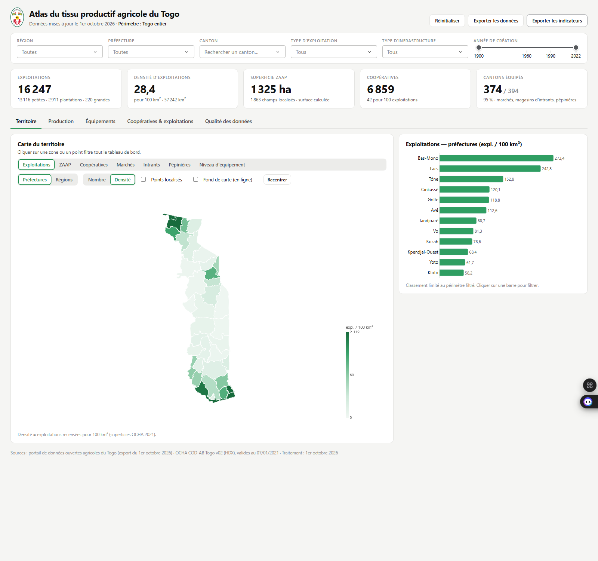

# Atlas du tissu productif agricole du Togo

Tableau de bord interactif qui cartographie les exploitations agricoles, les ZAAP, les coopératives,
les marchés, les magasins d'intrants et les pépinières du Togo, par région, préfecture et canton.

Construit en Python avec Dash, Plotly et GeoPandas. Il fonctionne entièrement en local, sans base de
données ni compte à créer.



## Sommaire

1. [Démarrage rapide](#1-démarrage-rapide)
2. [Installation pas à pas](#2-installation-pas-à-pas)
3. [Lancer l'application](#3-lancer-lapplication)
4. [Utiliser le tableau de bord](#4-utiliser-le-tableau-de-bord)
5. [Mettre à jour les données](#5-mettre-à-jour-les-données)
6. [Déployer pour plusieurs utilisateurs](#6-déployer-pour-plusieurs-utilisateurs)
7. [Vérifier que tout fonctionne](#7-vérifier-que-tout-fonctionne)
8. [Dépannage](#8-dépannage)
9. [Structure du projet](#9-structure-du-projet)
10. [Données et sources](#10-données-et-sources)

## 1. Démarrage rapide

Pour qui a déjà Python 3.10+ et Git :

```bash
git clone <URL-du-dépôt> atlas-agricole-togo
cd atlas-agricole-togo
python -m venv .venv
.venv\Scripts\activate          # Windows — sous Linux/macOS : source .venv/bin/activate
pip install -r requirements.txt
python app.py
```

Ouvrir ensuite <http://127.0.0.1:8050> dans un navigateur.

## 2. Installation pas à pas

### 2.1 Prérequis

| Élément          | Version                        | Vérifier           |
| ---------------- | ------------------------------ | ------------------ |
| Python           | 3.10, 3.11 ou 3.12             | `python --version` |
| pip              | fourni avec Python             | `pip --version`    |
| Git (facultatif) | toute version récente          | `git --version`    |
| Navigateur       | Chrome, Edge ou Firefox récent | —                  |

Environ 600 Mo d'espace disque (bibliothèques comprises) et 1 Go de mémoire vive suffisent.

**Installer Python** s'il est absent :

- **Windows** : télécharger l'installateur sur <https://www.python.org/downloads/> et cocher
  « Add python.exe to PATH » sur le premier écran.
- **macOS** : `brew install python@3.12`, ou l'installateur de python.org.
- **Linux (Debian/Ubuntu)** : `sudo apt install python3 python3-venv python3-pip`.

Sous Linux et macOS, la commande s'appelle souvent `python3` : remplacer `python` par `python3`
dans tout ce qui suit.

### 2.2 Récupérer le projet

Avec Git :

```bash
https://github.com/kkepiphane/data-agricole-togo.git
cd data-agricole-togo
```

Sans Git : sur la page GitHub du dépôt, bouton **Code → Download ZIP**, décompresser l'archive, puis
ouvrir un terminal dans le dossier obtenu (celui qui contient `app.py`).

### 2.3 Créer un environnement virtuel

L'environnement virtuel isole les bibliothèques du projet de celles du système.

Windows (PowerShell) :

```powershell
python -m venv .venv
.venv\Scripts\Activate.ps1
```

Windows (invite de commandes `cmd`) :

```bat
python -m venv .venv
.venv\Scripts\activate.bat
```

Linux / macOS :

```bash
python3 -m venv .venv
source .venv/bin/activate
```

Le terminal affiche `(.venv)` en début de ligne une fois l'environnement activé. Il faut le réactiver
à chaque nouveau terminal.

### 2.4 Installer les dépendances

```bash
pip install --upgrade pip
pip install -r requirements.txt
```

L'installation prend deux à cinq minutes. Aucun compilateur n'est nécessaire : toutes les
bibliothèques (dont GeoPandas) sont fournies précompilées pour Windows, macOS et Linux.

## 3. Lancer l'application

```bash
python app.py
```

Le terminal affiche `Dash is running on http://127.0.0.1:8050/`. Ouvrir cette adresse dans le
navigateur. Pour arrêter : `Ctrl + C` dans le terminal.

Les données nettoyées sont livrées dans `data/processed/` : le premier démarrage est immédiat. Si ce
dossier est vide, il est reconstruit automatiquement depuis `data/raw/` (environ 20 secondes).

| Commande                       | Effet                                                           |
| ------------------------------ | --------------------------------------------------------------- |
| `python app.py`                | Lance l'application sur le port 8050                            |
| `python app.py --port 8060`    | Utilise un autre port                                           |
| `python app.py --host 0.0.0.0` | Rend l'application accessible aux autres postes du réseau local |
| `python app.py --rebuild`      | Reconstruit les données traitées avant de démarrer              |
| `python app.py --debug`        | Mode développement (rechargement automatique du code)           |
| `python -m src.data_loader`    | Reconstruit les données sans lancer l'application               |

L'application fonctionne **hors ligne**. Seule l'option « Fond de carte (en ligne) » de la vue
Territoire demande une connexion Internet.

## 4. Utiliser le tableau de bord

**Cinq vues**, accessibles par les onglets :

| Vue                          | Contenu                                                                                     |
| ---------------------------- | ------------------------------------------------------------------------------------------- |
| Territoire                   | Carte par région ou préfecture, sélecteur de couche, classement                             |
| Production                   | Répartition par type d'exploitation, classement, années de création                         |
| Équipements                  | Carte des services, couverture territoriale, matrice canton × équipement                    |
| Coopératives & exploitations | Typologie en quatre quadrants, nuage de points, corrélation de Spearman, zones prioritaires |
| Qualité des données          | Complétude, contrôles, sources, avertissements                                              |

**Filtres** (barre du haut) : région, préfecture, canton, type d'exploitation, type d'infrastructure,
année de création. Ils s'appliquent à toutes les vues et aux cinq indicateurs du bandeau.

**Interactions** :

- Cliquer sur une zone de carte, un point ou une barre filtre tout le tableau de bord.
  Un second clic sur le même élément annule le filtre.
- « Réinitialiser » efface tous les filtres.
- Pour chercher un lieu, taper son nom dans la liste Préfecture ou Canton : la carte se recentre.
- La molette zoome sur la carte ; « Recentrer » rétablit le cadrage.

**Code couleur** : les données sont en **verts** (du clair au foncé selon l'intensité), avec un
ambre et un gris ardoise pour distinguer les catégories. L'**orange** signale une alerte (canton sans
service, préfecture à forte densité d'exploitations et faible présence coopérative, variable peu
renseignée). Dans l'interface, le vert marque ce qui est actif (onglet, option, filtre) ; sur les
cartes, la zone filtrée est entourée d'un trait foncé.

**Exports** :

- « Exporter les données » : CSV des enregistrements correspondant aux filtres.
- « Exporter les indicateurs » : CSV des indicateurs par préfecture.
- Icône appareil photo au survol d'un graphique : image PNG.

Les CSV utilisent le séparateur `;` et l'encodage UTF-8 : ils s'ouvrent directement dans Excel.

**Liens partageables** : l'adresse accepte `?vue=production`, `?region=Savanes`,
`?prefecture=Oti`, combinables : `http://127.0.0.1:8050/?vue=equipements&region=Savanes&prefecture=Oti`.

## 5. Mettre à jour les données

1. Exporter les jeux au format **CSV** depuis le portail de données ouvertes.
2. Placer les fichiers dans `data/raw/` à la place des anciens. Le nom de chaque fichier doit contenir
   l'un de ces mots, sans tenir compte des majuscules :

   | Jeu                   | Mot attendu dans le nom du fichier | Obligatoire |
   | --------------------- | ---------------------------------- | ----------- |
   | Grandes exploitations | `Grandes exploitations`            | oui         |
   | Petites exploitations | `Petites exploitations`            | oui         |
   | Plantations           | `Plantations`                      | oui         |
   | ZAAP / ZAPB           | `ZAAP`                             | oui         |
   | Coopératives          | `Coopératives`                     | oui         |
   | Marchés               | `Marchés`                          | oui         |
   | Pépinières            | `Pépinières`                       | oui         |
   | Magasins d'intrants   | `intrant`                          | non         |

3. Reconstruire puis relancer :

   ```bash
   python app.py --rebuild
   ```

Sans le jeu des magasins d'intrants, l'application démarre quand même : les indicateurs concernés
affichent « Donnée indisponible ».

Les limites administratives sont dans `data/raw/limites_admin/` (fichier `tgo_admin2.geojson`). Elles
proviennent du jeu « Togo - Subnational Administrative Boundaries » de la plateforme HDX
(<https://data.humdata.org/dataset/cod-ab-tgo>), archive GeoJSON à décompresser dans ce dossier.

## 6. Déployer pour plusieurs utilisateurs

`python app.py` suffit pour un usage personnel. Pour un service partagé, utiliser un serveur
d'applications. Le fichier `wsgi.py` expose l'application sous le nom `wsgi:server`.

### 6.1 Sur un poste ou un serveur Windows, Linux ou macOS (Waitress)

```bash
pip install waitress
waitress-serve --listen=0.0.0.0:8050 wsgi:server
```

Les collègues accèdent alors à `http://<adresse-IP-du-poste>:8050`. Pour connaître l'adresse IP :
`ipconfig` (Windows) ou `ip addr` (Linux). Autoriser le port 8050 dans le pare-feu si nécessaire.

### 6.2 Sur un serveur Linux (Gunicorn)

```bash
pip install gunicorn
gunicorn --bind 0.0.0.0:8050 --workers 2 --timeout 120 wsgi:server
```

Pour un démarrage automatique, créer `/etc/systemd/system/atlas.service` :

```ini
[Unit]
Description=Atlas agricole du Togo
After=network.target

[Service]
User=www-data
WorkingDirectory=/opt/atlas-agricole-togo
ExecStart=/opt/atlas-agricole-togo/.venv/bin/gunicorn --bind 127.0.0.1:8050 --workers 2 --timeout 120 wsgi:server
Restart=always

[Install]
WantedBy=multi-user.target
```

Puis :

```bash
sudo systemctl daemon-reload
sudo systemctl enable --now atlas
```

Placer ensuite Nginx ou Apache devant le port 8050 pour le nom de domaine et le HTTPS.

### 6.3 Sur une plateforme d'hébergement (Render, Railway, etc.)

| Paramètre               | Valeur                                                                |
| ----------------------- | --------------------------------------------------------------------- |
| Commande d'installation | `pip install -r requirements.txt gunicorn`                            |
| Commande de démarrage   | `gunicorn --bind 0.0.0.0:$PORT --workers 2 --timeout 120 wsgi:server` |
| Version de Python       | 3.11                                                                  |

### 6.4 Avec Docker

Créer un fichier `Dockerfile` à la racine :

```dockerfile
FROM python:3.11-slim
WORKDIR /app
COPY requirements.txt .
RUN pip install --no-cache-dir -r requirements.txt gunicorn
COPY . .
EXPOSE 8050
CMD ["gunicorn", "--bind", "0.0.0.0:8050", "--workers", "2", "--timeout", "120", "wsgi:server"]
```

Puis :

```bash
docker build -t atlas-agricole-togo .
docker run -p 8050:8050 atlas-agricole-togo
```

L'application n'a pas d'authentification : ne l'exposer sur Internet que derrière un contrôle d'accès
si les données ne doivent pas être publiques. Les sections 6.2 à 6.4 décrivent des configurations
usuelles qui n'ont pas été testées sur ce projet ; seuls `python app.py` et le chargement de
`wsgi:server` l'ont été.

## 7. Vérifier que tout fonctionne

```bash
python tests/smoke_test.py
```

Ce test exécute, sans navigateur, tous les traitements de l'application : démarrage, cinq vues,
filtres croisés, sept combinaisons de filtres (dont une sélection vide) et les deux exports. Il se
termine par « Tous les contrôles sont passés. ».

Pour régénérer les captures d'écran de `outputs/` (Windows, application démarrée, Edge ou Chrome) :

```powershell
powershell -ExecutionPolicy Bypass -File outputs\capture.ps1
```

## 8. Dépannage

| Symptôme                                        | Cause probable                                     | Solution                                                                                                 |
| ----------------------------------------------- | -------------------------------------------------- | -------------------------------------------------------------------------------------------------------- |
| `python` n'est pas reconnu                      | Python absent du PATH                              | Réinstaller en cochant « Add python.exe to PATH », ou utiliser `py` (Windows) / `python3` (Linux, macOS) |
| `Activate.ps1 cannot be loaded` (PowerShell)    | Exécution de scripts bloquée                       | `Set-ExecutionPolicy -Scope CurrentUser RemoteSigned`, puis réessayer                                    |
| `ModuleNotFoundError: No module named 'dash'`   | Environnement virtuel non activé                   | Activer `.venv` (section 2.3) puis `pip install -r requirements.txt`                                     |
| `Address already in use` / port occupé          | Une autre application utilise le port 8050         | `python app.py --port 8060`                                                                              |
| `Fichier brut introuvable pour « … »`           | Un CSV manque dans `data/raw/` ou son nom a changé | Voir le tableau de la section 5                                                                          |
| `Limites administratives introuvables`          | `data/raw/limites_admin/tgo_admin2.geojson` absent | Le télécharger depuis HDX (section 5)                                                                    |
| Carte blanche avec « Fond de carte (en ligne) » | Pas de connexion Internet                          | Décocher l'option : la carte fonctionne hors ligne                                                       |
| Carte vide dans un vieux navigateur             | WebGL désactivé                                    | Utiliser un navigateur récent ou activer l'accélération matérielle                                       |
| Accents illisibles dans Excel                   | Fichier ouvert avec un mauvais encodage            | Les exports sont en UTF-8 avec signature : les ouvrir par double-clic, pas par import manuel             |
| Page inaccessible depuis un autre poste         | Application liée à 127.0.0.1 ou pare-feu           | Lancer avec `--host 0.0.0.0` et ouvrir le port                                                           |

## 9. Structure du projet

```
app.py                  point d'entrée (python app.py)
wsgi.py                 point d'entrée pour un serveur de production
requirements.txt        dépendances
src/
  data_loader.py        lecture des fichiers bruts, construction et chargement des données traitées
  cleaning.py           normalisation des textes, années, listes
  geo.py                limites administratives, surfaces, contrôles spatiaux
  metrics.py            filtres, agrégations, densités, quadrants, Spearman, zones prioritaires
  figures.py            cartes et graphiques Plotly
  layouts.py            mise en page et vues
  callbacks.py          interactions, filtres croisés, exports
  theme.py              charte graphique (couleurs, formats)
assets/style.css        feuille de style
data/raw/               exports CSV du portail et limites administratives
data/processed/         jeu nettoyé, référentiels, contrôles qualité, dictionnaire de données
outputs/                captures d'écran des vues
tests/smoke_test.py     test de bon fonctionnement
rapport.md              rapport méthodologique
```

Pour changer les couleurs : `src/theme.py` (graphiques) et le bloc `:root` de `assets/style.css`
(interface). `FILL*` sont les verts des données, `SELECT` / `--select` le vert des éléments actifs,
`ACCENT` / `--accent` l'orange d'alerte.

**Logo** : l'en-tête affiche `assets/logo.svg` (armoiries du Togo). Pour le remplacer, déposer dans
`assets/` une image nommée `logo.svg`, `logo.png`, `logo.jpg` ou `logo.webp` ; pour le retirer,
supprimer le fichier.

## 10. Données et sources

| Fichier (`data/processed/`)                                    | Contenu                                                                     |
| -------------------------------------------------------------- | --------------------------------------------------------------------------- |
| `entites.csv`                                                  | 27 238 enregistrements nettoyés, toutes couches confondues                  |
| `prefectures.csv`, `prefectures.geojson`, `regions.geojson`    | 39 préfectures, 5 régions, superficies                                      |
| `cantons.csv`                                                  | 394 cantons présents dans les données                                       |
| `dictionnaire_donnees.csv`                                     | Dictionnaire de données : variable, type, observée ou calculée, description |
| `qualite_jeux.csv`, `qualite_completude.csv`, `exclusions.csv` | Contrôles qualité et enregistrements exclus                                 |
| `indicateurs_nationaux.csv`                                    | Indicateurs Banque mondiale (contexte national, non cartographiés)          |

| Source                                          | Contenu                                                  | Licence                    |
| ----------------------------------------------- | -------------------------------------------------------- | -------------------------- |
| Portail de données ouvertes agricoles du Togo   | 8 jeux géolocalisés, export du 1er octobre 2026          | données publiques ouvertes |
| OCHA COD-AB Togo v02, via HDX                   | Limites et superficies des régions et préfectures (2021) | CC BY-IGO                  |
| Banque mondiale, via HDX                        | Indicateurs nationaux 1960–2023                          | CC BY 4.0                  |
| Wikimedia Commons, « Coat of arms of Togo.svg » | Armoiries du Togo (`assets/logo.svg`)                    | CC BY-SA 4.0               |

Méthode, indicateurs, résultats et limites : voir [rapport.md](rapport.md).
